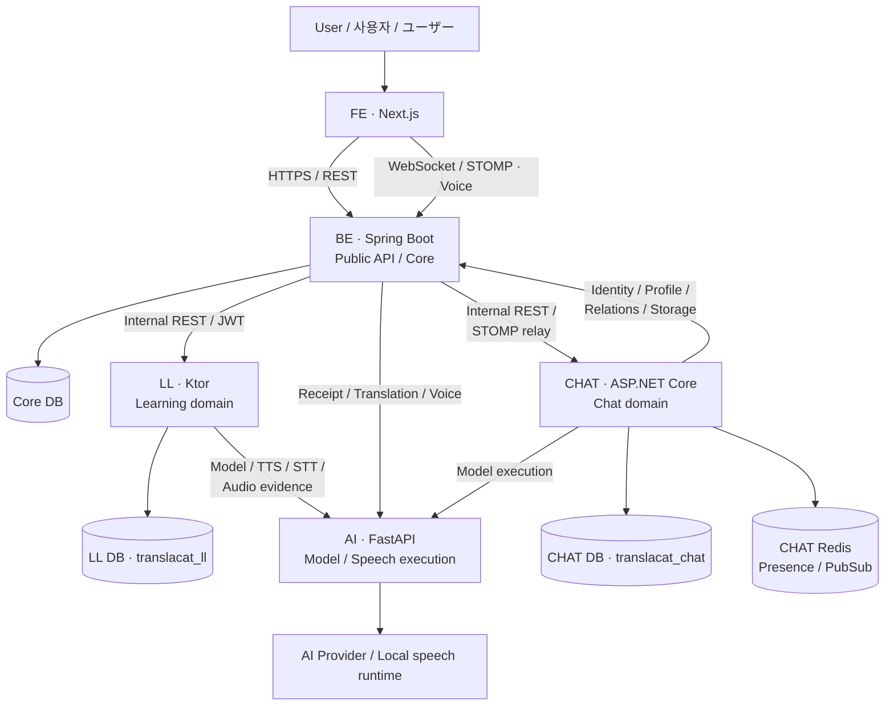
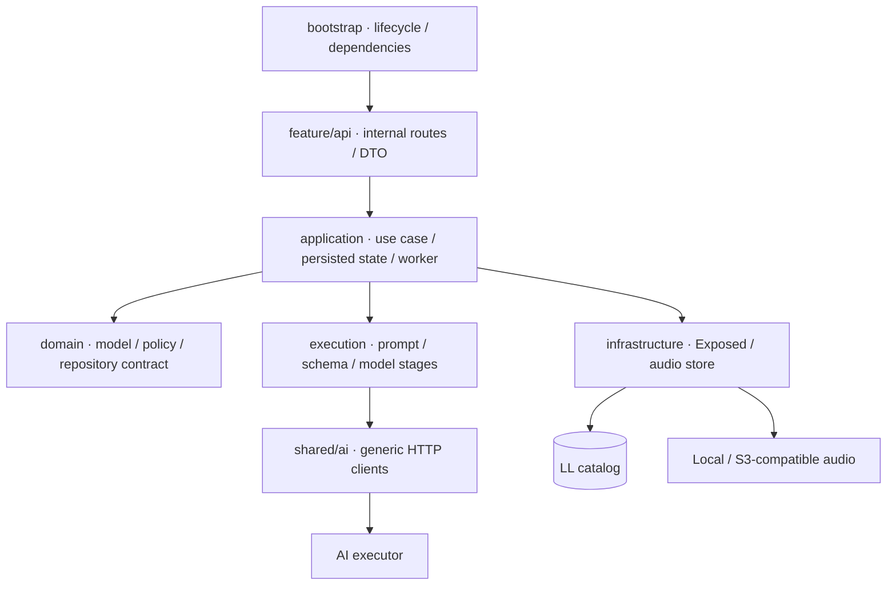
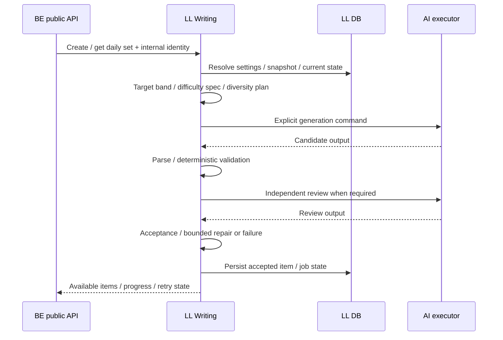
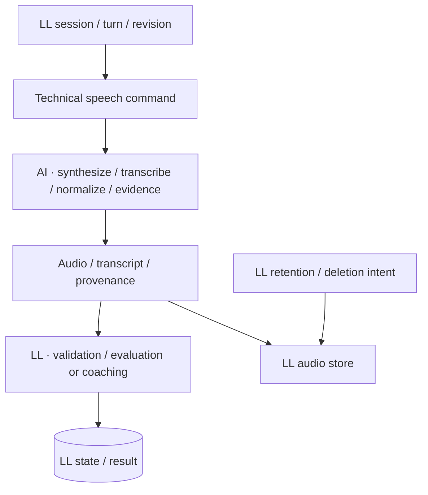

# TranslaCat Language Learning Service

> 학습 설정·문제·평가·음성 학습·성장 이력을 소유하는 Kotlin/Ktor 서비스  
> 学習設定・問題・評価・音声学習・成長履歴を所有するKotlin/Ktorサービス

TranslaCat의 FE / BE / AI / CHAT / LL 분리 구조를 설명하는 저장소 안내서입니다. 기술 버전과 경로는 2026-09-27 제공 소스 기준이며, 실행 환경의 실제 배포 상태나 테스트 통과를 의미하지 않습니다.  
TranslaCatのFE / BE / AI / CHAT / LL分離構成を説明するリポジトリガイドです。技術バージョンとパスは2026-09-27提供ソースを基準とし、実環境でのデプロイ状態やテスト成功を示すものではありません。

[개요 / 概要](#overview) · [구조 / 構成](#architecture) · [학습 흐름 / 学習フロー](#learning-flow) · [실행 / 起動](#setup) · [설정 / 設定](#configuration) · [테스트 / テスト](#tests) · [운영 / 運用](#operations)

---

<a id="overview"></a>

## 1. 개요 / 概要

TranslaCat Language Learning Service는 BE와 AI에 분산되어 있던 언어학습 업무를 Ktor와 전용 DB로 옮긴 서비스입니다. 설정·Keyword·Level Test·Writing·Listening·Speaking·Reading·Vocabulary·성장·통합 조회를 담당하며, 문제 생성과 평가의 업무 판단을 소유합니다.  
TranslaCat Language Learning ServiceはBEとAIに分散していた言語学習業務をKtorと専用DBへ移したサービスです。設定・Keyword・Level Test・Writing・Listening・Speaking・Reading・Vocabulary・成長・統合取得を担当し、問題生成と評価の業務判断を所有します。

BE는 사용자 인증과 공개 API 계약을 유지하고 LL의 내부 API를 호출합니다. LL은 학습 데이터·프롬프트·스키마·난이도·채점·작업 복구를 담당하며, AI 서버에는 모델·TTS/STT·오디오 근거 등 기술 실행을 요청합니다.  
BEはユーザー認証と公開API契約を維持し、LL内部APIを呼び出します。LLは学習data・prompt・schema・難易度・採点・job復旧を担当し、AIサーバーにはモデル・TTS/STT・音声根拠などの技術実行を要求します。

기존 루트 README는 Ktor 생성기 안내였으므로, 실제 기능과 초기화 조건을 기준으로 다시 구성했습니다. 과거 Phase 1 이슈의 BE/AI 책임 배분이나 Writing 전용 범위를 현재 구조로 그대로 복사하지 않습니다.  
従来のroot READMEはKtor generatorの案内だったため、実機能と初期化条件を基準に再構成しました。過去Phase 1 IssueのBE/AI責務分担やWriting専用範囲を、現在の構成へそのままコピーしません。

---

<a id="architecture"></a>

## 2. 시스템에서의 위치와 책임 / システム内での位置付けと責務



DB 상자는 데이터 책임과 논리 catalog를 나타냅니다. 이 그림만으로 서로 다른 물리 DB 서버·배포 호스트·고가용성 구성을 의미하지 않습니다. Storage 및 인증 공급자의 세부 연결은 각 기능 절에서 설명합니다.  
DBの箱はデータ責務と論理catalogを表します。この図だけで別々の物理DBサーバー・配置ホスト・高可用性構成を意味するものではありません。Storageと認証プロバイダーの詳細接続は各機能節で説明します。

| 영역 / 領域 | LL 책임 / LL責務 | 다른 서비스의 책임 / 他serviceの責務 |
| --- | --- | --- |
| 사용자 / ユーザー | 전달받은 사용자 문맥과 데이터 소유권 검증<br/>受け取ったユーザー文脈とdata所有権検証 | BE의 사용자 인증·계정 관리<br/>BEのユーザー認証・アカウント管理 |
| 학습 생성 / 学習生成 | 설정 적용·snapshot·Keyword·난이도·prompt·응답 검증<br/>設定適用・snapshot・Keyword・難易度・prompt・応答検証 | AI의 명시적 모델 실행 / AIの明示的モデル実行 |
| 평가 / 評価 | rubric·schema·deterministic scoring·version·이력<br/>rubric・schema・deterministic scoring・version・履歴 | AI의 출력 생성·기술 오류 분류<br/>AIの出力生成・技術エラー分類 |
| 음성 / 音声 | 과제·녹음 revision·세션·결과 해석·보존 정책·저장<br/>課題・録音revision・session・結果解釈・保持方針・保存 | AI의 TTS·STT·normalize·evidence 실행<br/>AIのTTS・STT・normalize・evidence実行 |
| UI | 화면에 필요한 상태·결과·복구 API 제공<br/>画面に必要な状態・結果・復旧API提供 | FE의 입력·녹음·표시·재진입 경험<br/>FEの入力・録音・表示・再開体験 |

LL은 BE의 HTTP 중계를 또 다른 중계로 대체한 서버가 아니라, 학습 업무 상태와 판단을 실제로 소유하는 서비스입니다. 반대로 AI SDK를 LL에 복사하거나 FE에 내부 키를 전달하지 않습니다.  
LLはBEのHTTP中継を別の中継に置き換えただけのサーバーではなく、学習業務の状態と判断を実際に所有するserviceです。一方でAI SDKをLLへコピーしたり、FEへ内部keyを渡したりはしません。

**관련 소스 / 関連ソース:** [Application composition](src/main/kotlin/jp/co/translacat/languagelearning/Application.kt) · [Model execution boundary](src/main/kotlin/jp/co/translacat/languagelearning/shared/ai) · [Internal authentication](src/main/kotlin/jp/co/translacat/languagelearning/bootstrap/InternalAuthentication.kt)

---

## 3. 기술 스택 / 技術スタック

| 구분 / 区分 | 선언된 기술 / 宣言された技術 |
| --- | --- |
| Language / JVM | Kotlin 2.4.0 · JDK 21 |
| Server | Ktor 3.6.0 · Netty · EngineMain |
| Concurrency | kotlinx.coroutines 1.11.0 |
| Persistence | Exposed 1.3.1 / JDBC · HikariCP 7.1.0 |
| Migration | Flyway 13.7.0 · flyway-mysql |
| Database driver | MySQL Connector/J 9.7.0 |
| Serialization / Auth | kotlinx.serialization · Ktor JWT authentication |
| Storage | Local audio store · S3-compatible SDK |
| Verification | kotlin.test + JUnit 4 · Ktor test host · explicit integration tasks |
| API documentation | Swagger UI · static documentation.yaml |

Ktor 버전은 `settings.gradle.kts`의 version catalog, 나머지 주요 버전은 `gradle/libs.versions.toml`과 `build.gradle.kts`를 기준으로 합니다. 일반 테스트는 JUnit 4를 사용하므로 JUnit 5 전용 명령이나 설정을 가정하지 않습니다.  
Ktor versionは`settings.gradle.kts`のversion catalog、他の主要versionは`gradle/libs.versions.toml`と`build.gradle.kts`を基準とします。通常testはJUnit 4を使用するため、JUnit 5専用コマンドや設定は仮定しません。

**관련 소스 / 関連ソース:** [Build](build.gradle.kts) · [Ktor catalog](settings.gradle.kts) · [Dependency versions](gradle/libs.versions.toml)

---

## 4. 기능별 구성 / 機能別構成

| Feature | 담당 기능 / 担当機能 |
| --- | --- |
| `settings` | 사용자/관리자 설정·유효값·적용일·학습일 정책<br/>ユーザー/管理者設定・有効値・適用日・学習日方針 |
| `keyword` | SYSTEM/CUSTOM·TOPIC/VOCABULARY·정규화·선택·학습 사실<br/>SYSTEM/CUSTOM・TOPIC/VOCABULARY・正規化・選択・学習事実 |
| `learner` | 학습자 기준과 공통 학습 문맥<br/>学習者基準と共通学習文脈 |
| `leveltest` | 세션·문항·답안·평가·기준 수준·오디오·prefetch<br/>session・問題・回答・評価・基準level・音声・prefetch |
| `writing` | Daily Set·문제 생성·검증/복구·답안·평가·보고서<br/>Daily Set・生成・検証/復旧・回答・評価・report |
| `practice` | Reading/Vocabulary 출제·정답·근거·숙련도·보고서<br/>Reading/Vocabulary出題・正解・根拠・習熟度・report |
| `listening` | 듣기 문제·TTS·세션/attempt·평가·리포트·오디오 관리<br/>聴解問題・TTS・session/attempt・評価・report・音声管理 |
| `speaking` | 발화 세션·턴·TTS/STT·평가/코칭·녹음/도움 이력·보존<br/>発話session・turn・TTS/STT・評価/coaching・録音/支援履歴・保持 |
| `growth` | 학습 활동·성장 snapshot·증거 집계<br/>学習活動・成長snapshot・根拠集計 |
| `overview` | Dashboard·통합 이력·추세·학습 상태 조합<br/>Dashboard・統合履歴・trend・学習状態の組み合わせ |

기능별 api/application/domain/infrastructure 구조를 기본 방향으로 사용합니다. 일부 기능은 `execution`을 별도 계층으로 두거나 infrastructure 바로 아래에 구현을 두고 있으므로 모든 폴더가 완전히 같은 형태라고 설명하지 않습니다.  
機能別api/application/domain/infrastructure構成を基本方向とします。一部機能は`execution`を別層としたりinfrastructure直下へ実装を置いたりするため、全folderが完全に同じ形とは説明しません。



**관련 소스 / 関連ソース:** [Features](src/main/kotlin/jp/co/translacat/languagelearning/features) · [Bootstrap](src/main/kotlin/jp/co/translacat/languagelearning/bootstrap) · [Shared technical modules](src/main/kotlin/jp/co/translacat/languagelearning/shared)

---

<a id="learning-flow"></a>

## 5. 학습 생성·평가·복구 흐름 / 学習生成・評価・復旧フロー

### 설정과 snapshot / 設定とsnapshot

사용자 설정·관리자 정책·Keyword·학습자 문맥으로 학습 조건을 계산하고 생성 시점의 조건을 snapshot으로 보존합니다. 설정을 바꿨다는 이유만으로 이미 생성한 문항·답안을 덮어쓰지 않으며, 적용일과 재생성 정책은 기능별 규칙을 따릅니다.  
ユーザー設定・管理者方針・Keyword・学習者文脈から学習条件を計算し、生成時点の条件をsnapshotとして保持します。設定変更だけを理由に生成済み問題・回答を上書きせず、適用日と再生成方針は各機能の規則に従います。

### Writing 생성과 독립 검증 / Writing生成と独立検証



Writing의 프롬프트·생성 schema·난이도 spec·다양성·본문 언어 복구·독립 검토 수락 규칙은 LL 소스에 있습니다. 단순히 모델이 자신 있게 답했다는 이유로 목표 band를 바꾸거나 부적합 후보를 정상 문항으로 저장하는 구조로 설명하지 않습니다.  
Writingのprompt・生成schema・難易度spec・多様性・本文言語復旧・独立review受理規則はLLソースにあります。モデルが自信を持って答えたという理由だけで目標bandを変更したり、不適合候補を正常問題として保存したりする構成としては説明しません。

### 답안과 평가의 분리 / 回答と評価の分離

답안·평가 작업·결과를 별도로 관리하여, 답안은 저장되었지만 평가가 대기/실패한 상태를 표현합니다. worker는 저장된 작업·lease·revision을 기준으로 처리하고, 완료한 결과와 실패·재시도 대상을 구분합니다. 점수 계산과 버전 해석은 LL의 평가 정책을 기준으로 합니다.  
回答・評価job・結果を別管理し、回答は保存済みでも評価が待機/失敗している状態を表現します。workerは保存job・lease・revisionを基準に処理し、完了結果と失敗・再試行対象を区別します。点数計算とversion解釈はLLの評価方針を基準とします。

기능별 생성·평가·복구 예산은 서로 다릅니다. AI 내부에서 무제한 재시도를 숨기는 대신, LL이 남은 시간과 호출 단계·실패 종류를 관리하고 범용 실행 API에 명시적으로 전달합니다.  
機能ごとの生成・評価・復旧予算は異なります。AI内部へ無制限retryを隠す代わりに、LLが残り時間・呼び出し段階・失敗種別を管理し、汎用実行APIへ明示的に渡します。

**관련 소스 / 関連ソース:** [Writing state / workers](src/main/kotlin/jp/co/translacat/languagelearning/features/writing/application) · [Writing policy / prompt / scoring](src/main/kotlin/jp/co/translacat/languagelearning/features/writing/domain/policy) · [Writing HTTP routes](src/main/kotlin/jp/co/translacat/languagelearning/features/writing/api/WritingPreparedRoutes.kt) · [Model HTTP adapter](src/main/kotlin/jp/co/translacat/languagelearning/shared/ai/HttpModelExecution.kt)

---

## 6. Listening·Speaking·음성 보존 / Listening・Speaking・音声保持

Listening은 문제 생성과 TTS 준비 상태, session/attempt, 답안·평가와 보고서를 연결합니다. Speaking은 session·turn·녹음 revision·인식문·대화·평가 또는 coaching을 관리합니다. 두 기능 모두 “오디오 파일이 존재한다”와 “해당 사용자·세션에서 사용할 수 있다”를 구분합니다.  
Listeningは問題生成とTTS準備状態、session/attempt、回答・評価とreportを結び付けます。Speakingはsession・turn・録音revision・認識文・会話・評価またはcoachingを管理します。両機能とも「音声fileが存在する」と「該当ユーザー・sessionで使用できる」を区別します。



STT에서 반환한 인식문과 실제 발화 오류를 동일시하지 않고, 녹음/인식 근거와 평가·코칭 정책을 함께 사용합니다. 도움 사용·재녹음·원본 revision이 달라지면 기존 평가 결과와의 연결도 다시 검증해야 합니다.  
STTの認識文と実際の発話誤りを同一視せず、録音/認識根拠と評価・coaching方針を合わせて使用します。支援利用・再録音・原本revisionが変われば、既存評価結果との対応も再検証します。

Speaking 저장소는 `local` 또는 `s3`를 명시합니다. S3 호환 설정은 endpoint·region·bucket·accessKey·secretKey를 요구하며 암묵적인 기본 AWS credential chain으로 대체하지 않습니다. Level Test의 로컬 audioRoot와 Speaking 저장소는 별도 설정입니다.  
Speaking storageは`local`または`s3`を明示します。S3互換設定はendpoint・region・bucket・accessKey・secretKeyを要求し、暗黙の標準AWS credential chainへ置き換えません。Level Testのlocal audioRootとSpeaking storageは別設定です。

음성 삭제·세션 만료는 학습 DB 상태와 보존 작업으로 관리합니다. 현재 일부 만료/보존 worker는 프로세스 현지 시각을 사용하므로, 사용자 학습일 timezone과 서버 실행 timezone을 동일한 개념으로 취급하지 않습니다.  
音声削除・session期限切れは学習DB状態と保持jobで管理します。現在一部の期限/保持workerはprocess現地時刻を使用するため、ユーザー学習日timezoneとサーバー実行timezoneを同一概念として扱いません。

**관련 소스 / 関連ソース:** [Listening composition](src/main/kotlin/jp/co/translacat/languagelearning/bootstrap/Listening.kt) · [Speaking composition](src/main/kotlin/jp/co/translacat/languagelearning/bootstrap/Speaking.kt) · [Speaking execution](src/main/kotlin/jp/co/translacat/languagelearning/features/speaking/execution) · [Speaking storage](src/main/kotlin/jp/co/translacat/languagelearning/features/speaking/infrastructure)

---

## 7. DB·트랜잭션·데이터 경계 / DB・トランザクション・data境界

업무 DB의 기본 catalog는 `translacat_ll`입니다. 접속 전에 JDBC URL과 expectedCatalog를 비교하고, 실제 선택된 catalog도 검사한 다음 Flyway migration 또는 validation을 수행합니다. Core/system catalog를 잘못 대상으로 선택하는 사고를 줄이기 위한 guard가 있습니다.  
業務DBの標準catalogは`translacat_ll`です。接続前にJDBC URLとexpectedCatalogを比較し、実際に選択されたcatalogも検査してからFlyway migrationまたはvalidationを実行します。Core/system catalogを誤って対象とする事故を減らすguardがあります。

catalog 자체를 자동 생성하지 않으며, 사용자/비밀번호는 URL에 포함하지 않고 별도 설정합니다. `createDatabaseIfNotExist`나 sessionVariables로 접속 대상을 우회하지 않습니다. 이러한 guard는 DB 계정 권한의 대체물이 아니므로 전용 권한도 필요합니다.  
catalog自体は自動作成せず、ユーザー/パスワードはURLに埋め込まず別設定にします。`createDatabaseIfNotExist`やsessionVariablesで接続先を迂回しません。これらのguardはDBアカウント権限の代替ではないため、専用権限も必要です。

| 구성 / 構成 | 역할 / 役割 |
| --- | --- |
| Hikari / JDBC | pool·접속 수·timeout / pool・接続数・timeout |
| Exposed / UnitOfWork | 기능별 repository와 transaction 조립<br/>機能別repositoryとtransactionの組み立て |
| Flyway `migrate` | 기동 전 schema 변경 적용; 권한·백업 확인 필요<br/>起動前schema変更適用。権限・backup確認が必要 |
| Flyway `validate` | 별도 migration 적용 후 schema 이력 검증<br/>別途migration適用後にschema履歴を検証 |
| Stored intent / lease | 생성·평가·복구 작업의 지속 상태<br/>生成・評価・復旧jobの持続状態 |

새 LL DB 구성과 과거 학습 데이터 이관은 별도 작업입니다. 제공 migration이 존재한다는 것만으로 기존 BE 데이터가 복사되거나 운영 데이터를 삭제해도 된다는 뜻은 아닙니다. 배포 전에 유지/초기화 범위를 명시합니다.  
新LL DB構成と過去学習data移行は別作業です。migrationが存在するだけで旧BE dataがコピーされる、または本番dataを削除してよいことを意味しません。配置前に保持/初期化範囲を明示します。

**관련 소스 / 関連ソース:** [DB bootstrap](src/main/kotlin/jp/co/translacat/languagelearning/bootstrap/Persistence.kt) · [DB settings loader](src/main/kotlin/jp/co/translacat/languagelearning/bootstrap/DatabaseSettingsLoader.kt) · [Target guard](src/main/kotlin/jp/co/translacat/languagelearning/shared/persistence/DatabaseTargetGuard.kt) · [Migration SQL](src/main/resources/db/migration)

---

## 8. 인증과 내부 API / 認証と内部API

BE → LL은 전용 HMAC JWT와 issuer·audience·callerService·TTL 계약을 사용합니다. 외부 사용자 JWT를 내부 서비스 토큰으로 단순 재사용하지 않습니다. 내부 인증을 통과한 뒤에도 사용자·관리자 권한과 학습 데이터 소유권을 기능별로 확인합니다.  
BE → LLは専用HMAC JWTとissuer・audience・callerService・TTL契約を使用します。外部ユーザーJWTを内部service tokenとして単純再利用しません。内部認証通過後もユーザー・管理者権限と学習data所有権を機能ごとに確認します。

| 경계 / 境界 | 용도 / 用途 |
| --- | --- |
| `GET /health` | 프로세스 생존; 전체 AI·업무 준비 보증 아님<br/>process生存。全AI・業務準備の保証ではない |
| `/openapi` | 정적 documentation.yaml 기반 Swagger UI<br/>static documentation.yamlによるSwagger UI |
| `/internal/v1/language-learning/settings` | 사용자 설정 / ユーザー設定 |
| `/internal/v1/admin/language-learning/settings` | 관리자 설정 / 管理者設定 |
| `/internal/v1/language-learning/keywords` | Keyword 관리 / Keyword管理 |
| `/internal/v1/language-learning/level-test` | 상태·session·문항·평가·audio·history<br/>状態・session・問題・評価・audio・history |
| `/internal/v1/language-learning/writing/daily` | set·생성·재생성·답안·평가 재개<br/>set・生成・再生成・回答・評価再開 |
| `/internal/v1/language-learning/practice` | Reading / Vocabulary |
| `/internal/v1/language-learning/listening` | Listening |
| `/internal/v1/language-learning/speaking` | Speaking |
| `/internal/v1/language-learning/overview` | 통합 조회 / 統合取得 |
| `/internal/v1/language-learning/growth` | 성장·활동 / 成長・活動 |

표는 API 그룹 경로이며 모든 항목이 root의 단일 endpoint라는 의미는 아닙니다. 업로드 URL·ticket 등의 특수 경계는 해당 route 계약을 따릅니다. `documentation.yaml`은 전체 기능을 모두 기술한 자동 생성 명세가 아니므로, 정확한 method·하위 경로·payload는 각 API 소스를 확인합니다.  
表はAPI group pathであり、全項目がrootの単一endpointという意味ではありません。upload URL・ticketなどの特殊境界は各route契約に従います。`documentation.yaml`は全機能を網羅した自動生成specではないため、正確なmethod・下位path・payloadは各APIソースを確認します。

**관련 소스 / 関連ソース:** [JWT settings](src/main/kotlin/jp/co/translacat/languagelearning/shared/security) · [Internal auth setup](src/main/kotlin/jp/co/translacat/languagelearning/bootstrap/InternalAuthentication.kt) · [Writing routes](src/main/kotlin/jp/co/translacat/languagelearning/features/writing/api/WritingPreparedRoutes.kt) · [Level Test routes](src/main/kotlin/jp/co/translacat/languagelearning/features/leveltest/api/LevelTestRoutes.kt) · [Static API document](src/main/resources/documentation.yaml)

---

## 9. 디렉터리 구조 / ディレクトリ構成

```text
src/main/kotlin/jp/co/translacat/languagelearning/
├─ Application.kt
├─ bootstrap/                     # lifecycle / DI / routing / workers
├─ features/
│  ├─ settings/  keyword/  learner/
│  ├─ leveltest/  writing/  practice/
│  ├─ listening/  speaking/
│  └─ growth/  overview/
└─ shared/
   ├─ ai/                         # model / speech technical clients
   ├─ diversity/  schema/
   ├─ error/  http/  identity/
   ├─ persistence/
   └─ security/
src/main/resources/
├─ application.yaml               # Ktor module / port only
├─ documentation.yaml
├─ db/migration/
└─ leveltest/ writing/ practice/ listening/ speaking/
src/test/kotlin/
config/application-prod.yaml
docs/sql/
tools/
scripts/
```

---

<a id="setup"></a>

## 10. 로컬 실행 / ローカル起動

JDK 21을 준비하고 Gradle Wrapper를 사용합니다. 제공 `application.yaml`에는 Ktor module과 기본 port 8081만 있으며, 애플리케이션은 `database.enabled`의 명시 설정을 요구합니다. 따라서 생성기 README의 `./gradlew run`만 실행하면 설정 부족으로 실패할 수 있습니다.  
JDK 21を用意しGradle Wrapperを使用します。提供`application.yaml`にはKtor moduleと標準port 8081のみがあり、アプリケーションは`database.enabled`の明示設定を要求します。そのためgenerator READMEの`./gradlew run`だけでは設定不足で失敗する場合があります。

```powershell
java -version
./gradlew.bat --version
./gradlew.bat build
```

### 프로세스·문서 확인용 최소 구성 / プロセス・文書確認用の最小構成

DB·업무 API 없이 기동 경계만 확인하려면 다음 내용을 `config/application-local.yaml`로 직접 작성합니다. 이는 전체 학습 서비스의 정상 동작을 검증하는 구성이 아닙니다.  
DB・業務APIなしで起動境界だけを確認する場合、次の内容を`config/application-local.yaml`として作成します。これは学習service全体の正常動作を検証する構成ではありません。

```yaml
ktor:
  deployment:
    port: 8081
  application:
    modules:
      - jp.co.translacat.languagelearning.ApplicationKt.module
database:
  enabled: false
internalApi:
  enabled: false
```

```powershell
./gradlew.bat run --args="-config=config/application-local.yaml"
# 별도 터미널 / 別ターミナル
Invoke-RestMethod http://127.0.0.1:8081/health
```

Bash에서는 동일 명령의 `./gradlew.bat`를 `./gradlew`로 바꿉니다. 이 실행은 명시한 YAML을 EngineMain에 전달하므로 필요한 ktor module/port 설정도 해당 파일에 포함합니다.  
Bashでは同コマンドの`./gradlew.bat`を`./gradlew`へ変更します。この実行は指定YAMLをEngineMainへ渡すため、必要なktor module/port設定も同fileへ含めます。

### DB·실제 학습 기능을 사용하는 구성 / DB・実学習機能を使用する構成

실제 실행 시에는 위 최소 구성을 대체하는 환경별 YAML을 준비합니다. 공통 필수 항목과 기능별 활성화 조건은 다음 절을 따릅니다. `config/application-prod.yaml`은 DB·내부 인증·AI·Level Test 참고 설정이며, 모든 기능과 Ktor 기동 설정을 완성한 단독 파일은 아닙니다.  
実実行時には上記最小構成を置き換える環境別YAMLを用意します。共通必須項目と機能別有効化条件は次節に従います。`config/application-prod.yaml`はDB・内部認証・AI・Level Testの参考設定であり、全機能とKtor起動設定を完成させた単独fileではありません。

**관련 소스 / 関連ソース:** [Default YAML](src/main/resources/application.yaml) · [Environment reference](config/application-prod.yaml) · [Entrypoint](src/main/kotlin/jp/co/translacat/languagelearning/Application.kt) · [Required database setting](src/main/kotlin/jp/co/translacat/languagelearning/bootstrap/DatabaseSettingsLoader.kt)

---

<a id="configuration"></a>

## 11. 설정과 기능 활성화 / 設定と機能有効化

| 설정 / 設定 | 조건·용도 / 条件・用途 |
| --- | --- |
| `database.enabled` | 반드시 true/false 명시; true일 때 JDBC·계정·catalog 필수<br/>true/false必須。trueならJDBC・資格情報・catalog必須 |
| `database.jdbcUrl`, `expectedCatalog` | 단일 MySQL host·전용 catalog 일치 / 単一MySQL host・専用catalog一致 |
| `database.username`, `password` | URL과 분리된 자격증명 / URLから分離した資格情報 |
| `database.migrations.mode` | migrate 또는 validate / migrateまたはvalidate |
| `internalApi.enabled` | 인증된 학습 API 활성화; DB 필요<br/>認証済み学習API有効化。DB必須 |
| `internalApi.secretBase64` | BE → LL 전용키; issuer/audience/callerService와 일치<br/>BE → LL専用key。各claim設定を一致 |
| `aiServer.url`, `apiKey` | 범용 모델/음성 API origin·인증 / 汎用モデル/音声API origin・認証 |
| `levelTest.enabled` | 내부 인증·DB·AI·audioUploadBaseUrl 필요<br/>内部認証・DB・AI・audioUploadBaseUrl必須 |
| `writing.enabled` · `practice.enabled` · `listening.enabled` | 기능별 명시적 활성화; 내부 인증·DB·AI 필요<br/>機能別に明示有効化。内部認証・DB・AI必須 |
| `speaking.enabled` | 추가로 audio storage 설정·ttsModel 필요<br/>追加でaudio storage設定・ttsModel必須 |
| `growth.enabled` | 성장 기능; DB·내부 인증 필요<br/>成長機能。DB・内部認証必須 |
| `overview.enabled` | DB·내부 인증 및 Level Test service 의존성 필요<br/>DB・内部認証とLevel Test service依存関係が必要 |

기능 flag는 기본적으로 명시적 활성화가 필요합니다. 환경변수에 임의 이름을 추가한다고 Ktor가 자동으로 해당 속성에 연결하는 것은 아닙니다. 사용 중인 YAML에서 `${...}`로 환경변수를 매핑하거나 속성 자체를 명시해야 합니다.  
機能flagは基本的に明示有効化が必要です。環境変数へ任意名を追加してもKtorが自動的に該当propertyへ結び付けるわけではありません。使用YAMLで`${...}`による環境変数mappingを定義するか、property自体を明示します。

아래는 설정을 조립할 때 사용할 학습 기능 구성 예시입니다. 앞 절의 ktor 블록을 유지하고, 각 secret·경로·Provider 모델 값을 준비해 사용합니다. `LL_SPEAKING_AUDIO_DIRECTORY`와 `LL_SPEAKING_TTS_MODEL`은 이 예시에서 명시적으로 매핑한 변수이며 기존 prod YAML에 자동으로 존재하는 설정은 아닙니다.  
次は設定組み立て時の学習機能構成例です。前節のktor blockを維持し、各secret・path・Provider model値を準備して使用します。`LL_SPEAKING_AUDIO_DIRECTORY`と`LL_SPEAKING_TTS_MODEL`は本例で明示mappingした変数であり、既存prod YAMLへ自動的に存在する設定ではありません。

```yaml
database:
  enabled: true
  jdbcUrl: ${DB_JDBC_URL}
  expectedCatalog: translacat_ll
  username: ${DB_USERNAME}
  password: ${DB_PASSWORD}
  migrations:
    mode: validate
internalApi:
  enabled: true
  issuer: translacat-be
  audience: translacat-ll
  callerService: translacat-be
  secretBase64: ${LL_INTERNAL_JWT_SECRET_BASE64}
  maxTtlSeconds: 120
  clockSkewSeconds: 5
aiServer:
  url: ${AI_SERVER_URL}
  apiKey: ${AI_SERVER_API_KEY}
levelTest:
  enabled: true
  audioUploadBaseUrl: ${LL_LEVEL_TEST_AUDIO_UPLOAD_BASE_URL}
  audioRoot: ${LL_LEVEL_TEST_AUDIO_ROOT}
writing:
  enabled: true
practice:
  enabled: true
listening:
  enabled: true
speaking:
  enabled: true
  ttsModel: ${LL_SPEAKING_TTS_MODEL}
  audio:
    storage: local
    directory: ${LL_SPEAKING_AUDIO_DIRECTORY}
growth:
  enabled: true
overview:
  enabled: true
```

이 예시의 `validate`는 schema가 이미 올바르게 준비된 환경용입니다. 신규 환경에서 migration을 적용해야 한다면 대상 catalog·권한·백업을 확인한 뒤 `migrate`로 별도 수행합니다. `.env` 파일을 저장하기만 하면 위 변수가 자동 주입된다고 가정하지 않습니다.  
この例の`validate`はschemaが既に正しく準備された環境向けです。新環境でmigration適用が必要なら、対象catalog・権限・backupを確認して`migrate`を別途実行します。`.env`を保存するだけで上記変数が自動注入されるとは仮定しません。

`audioUploadBaseUrl`은 실제 업로드 주체가 도달할 수 있는 계약상의 주소여야 합니다. 단순히 LL의 loopback 주소를 브라우저가 접근할 수 있는 주소라고 가정하지 않습니다. Speaking 파일 디렉터리는 영속 위치와 접근권한·git ignore를 명시하고, TTS 모델 값은 AI가 사용하는 실제 음성 계약과 맞춥니다.  
`audioUploadBaseUrl`は実upload主体が到達できる契約上のアドレスである必要があります。LLのloopback addressをブラウザーから到達可能だと単純仮定しません。Speaking file directoryは永続場所・アクセス権・git ignoreを明示し、TTS model値はAIが使用する実音声契約へ合わせます。

**관련 소스 / 関連ソース:** [Internal config loader](src/main/kotlin/jp/co/translacat/languagelearning/bootstrap/InternalApiSettingsLoader.kt) · [Generic model setup](src/main/kotlin/jp/co/translacat/languagelearning/bootstrap/ModelExecution.kt) · [Level Test setup](src/main/kotlin/jp/co/translacat/languagelearning/bootstrap/LevelTest.kt) · [Speaking setup](src/main/kotlin/jp/co/translacat/languagelearning/bootstrap/Speaking.kt) · [Overview dependencies](src/main/kotlin/jp/co/translacat/languagelearning/bootstrap/Overview.kt)

---

<a id="tests"></a>

## 12. 테스트와 검증 범위 / テストと検証範囲

일반 `test`는 외부 DB/AI HTTP 통합 테스트를 분리하도록 구성되어 있습니다. 따라서 `build` 성공만으로 실 MySQL·AI·BE까지 검증했다고 말하지 않습니다. 통합 task는 필요한 환경변수가 없으면 명시적으로 실패하도록 되어 있습니다.  
通常`test`は外部DB/AI HTTP統合testを分離する設定です。そのため`build`成功だけで実MySQL・AI・BEまで検証したとは言いません。統合taskは必要環境変数がなければ明示的に失敗する構成です。

```powershell
./gradlew.bat test
./gradlew.bat build
```

| Task | 필수 준비 / 必須準備 |
| --- | --- |
| `databaseIntegrationTest` | `LL_TEST_MYSQL_URL`, `LL_TEST_MYSQL_USERNAME`, `LL_TEST_MYSQL_PASSWORD` |
| `aiHttpIntegrationTest` | `LL_TEST_AI_URL`; 로컬 test-only Python server / ローカルtest-only Python server |
| `writingHttpDatabaseIntegrationTest` | 위 MySQL 변수와 AI URL 모두 / 上記MySQL変数とAI URLすべて |
| `levelTestHttpDatabaseIntegrationTest` | 위 MySQL 변수와 AI URL 모두 / 上記MySQL変数とAI URLすべて |

```powershell
./gradlew.bat databaseIntegrationTest
./gradlew.bat aiHttpIntegrationTest
./gradlew.bat writingHttpDatabaseIntegrationTest
./gradlew.bat levelTestHttpDatabaseIntegrationTest
```

DB 통합 테스트는 loopback과 별도 테스트 catalog 등 소유 경계 검증을 사용합니다. 운영 또는 BE/CHAT DB를 넣어 통과시키지 않습니다. AI HTTP 통합은 test-only 서버에 대한 계약 검증이며 실 Provider 호출 성공이나 생성 품질 검증과 다릅니다.  
DB統合testはloopbackと専用test catalogなどの所有境界検証を使用します。本番やBE/CHAT DBを指定して通過させません。AI HTTP統合はtest-only serverへの契約検証であり、実Provider呼び出し成功や生成品質検証とは異なります。

Gradle 오류 메시지가 참조하는 `docs/database-foundation.md`는 제공 ZIP에 없습니다. 실행 task와 테스트 fixture의 현재 소스를 기준으로 환경을 구성하고, 누락된 문서가 포함되어 있다고 전제하지 않습니다. 이번 README 작성에서는 위 테스트를 실행하지 않았습니다.  
Gradleエラーメッセージが参照する`docs/database-foundation.md`は提供ZIPにありません。実行taskとtest fixtureの現ソースを基準に環境を構成し、欠落文書が含まれているとは前提にしません。今回のREADME作成では上記testを実行していません。

**관련 소스 / 関連ソース:** [Test task definitions](build.gradle.kts) · [Test implementations](src/test/kotlin) · [SQL verification](docs/sql/verify_settings_port.sql)

---

## 13. 기능별 설계 소스 찾기 / 機能別の設計ソース案内

| 변경하려는 내용 / 変更内容 | 우선 확인할 위치 / 優先確認場所 |
| --- | --- |
| 출제·난이도·검증 / 出題・難易度・検証 | `features/writing/domain/policy`, `features/practice`, `features/leveltest` |
| 생성/평가 재개 / 生成・評価再開 | 각 feature의 application state / worker / execution<br/>各featureのapplication state / worker / execution |
| STT/TTS·발화 평가 / STT/TTS・発話評価 | `features/speaking/execution`, `shared/ai`, `bootstrap/Speaking.kt` |
| DB·인덱스·관계 / DB・index・関係 | `src/main/resources/db/migration`, 각 feature infrastructure<br/>各feature infrastructure |
| 공통 조회·성장 / 共通取得・成長 | `features/overview`, `features/growth` |
| 내부 HTTP 계약 / 内部HTTP契約 | 각 feature/api와 `shared/security`<br/>各feature/apiと`shared/security` |

프롬프트만 바꾸면 해결되는 문제인지, 저장 상태·불변조건·생성 규칙·평가 정책을 함께 수정해야 하는 문제인지 구분합니다. 정책 버전·schema·fixture와 실제 실행 경계를 함께 확인하여 문서와 구현이 갈라지지 않도록 합니다.  
promptだけの変更で解決する問題か、保存状態・不変条件・生成規則・評価方針も変更すべき問題かを区別します。policy version・schema・fixtureと実実行境界を合わせて確認し、文書と実装が乖離しないようにします。

---

<a id="operations"></a>

## 14. 운영과 문제 해결 / 運用とトラブル対応

| 증상 / 症状 | 확인할 내용 / 確認事項 |
| --- | --- |
| `Missing configuration: database.enabled` | 환경별 YAML을 EngineMain에 명시하고 필수 설정 포함<br/>環境別YAMLをEngineMainへ明示し必須設定を含める |
| 특정 기능 404 / 特定機能404 | 기능 enabled·internalApi·실제 route 그룹 확인<br/>機能enabled・internalApi・実route group確認 |
| 내부 인증 실패 / 内部認証失敗 | BE/LL 방향키·issuer·audience·callerService·TTL·서버 시각<br/>BE/LL方向key・各claim・TTL・サーバー時刻 |
| DB 기동 실패 / DB起動失敗 | catalog 일치·권한·migration mode·schema version 확인<br/>catalog一致・権限・migration mode・schema version確認 |
| Overview 초기화 실패 / 初期化失敗 | Level Test service 등 의존 기능의 구성 확인<br/>Level Test serviceなど依存機能の構成確認 |
| Speaking 초기화 실패 / 初期化失敗 | audio.storage와 모드별 필수값·ttsModel 확인<br/>audio.storageとmode別必須値・ttsModel確認 |
| 생성/평가 대기 / 生成・評価待機 | 저장 job·lease·retry 가능 시각·AI deadline·worker 로그<br/>保存job・lease・retry可能時刻・AI deadline・worker log |

`scripts/restart-local-ktor.ps1`과 retirement 관련 스크립트는 특정 검증 workspace·설정·runtime을 전제로 하는 도구입니다. 이를 모든 PC에서 사용할 일반 설치/재시작 절차로 취급하지 않습니다. 이번 ZIP에는 LL 전용 Dockerfile이나 CI 배포 workflow가 없으므로 존재하지 않는 배포 명령도 추가하지 않습니다.  
`scripts/restart-local-ktor.ps1`とretirement関連scriptは特定検証workspace・設定・runtimeを前提とするtoolです。全PC共通の一般install/restart手順として扱いません。今回のZIPにはLL専用DockerfileやCI配置workflowがないため、存在しない配置コマンドも追加しません。

전환 후에도 BE 공개 계약, 내부 인증, LL 데이터 소유권, AI 실행 계약, 음성 저장/정리, 재기동 후 작업 복구를 함께 확인해야 합니다. 프로세스 생존·단위 테스트·실 Provider 품질·운영 배포는 각각 별도의 검증 결과로 기록합니다.  
切替後もBE公開契約、内部認証、LL data所有権、AI実行契約、音声保存/cleanup、再起動後job復旧を合わせて確認する必要があります。process生存・単体test・実Provider品質・本番配置はそれぞれ別検証結果として記録します。

**관련 소스 / 関連ソース:** [Lifecycle / feature composition](src/main/kotlin/jp/co/translacat/languagelearning/bootstrap) · [Operational scripts](scripts) · [Verification utilities](tools)
